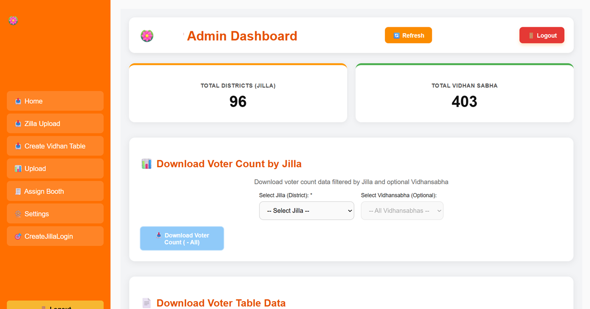
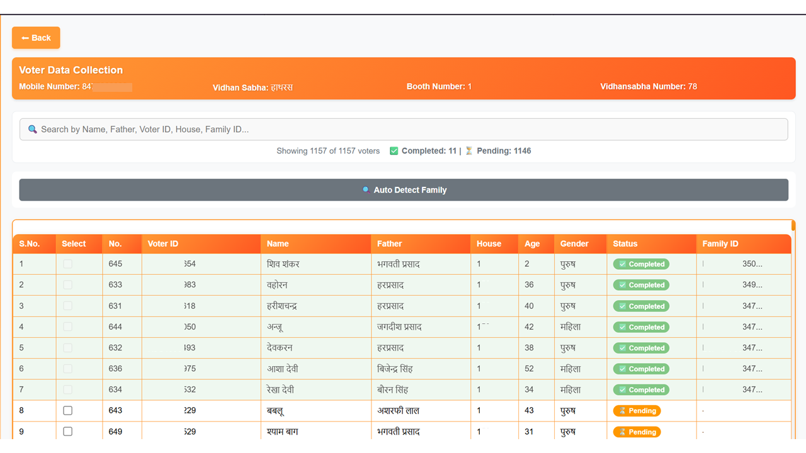
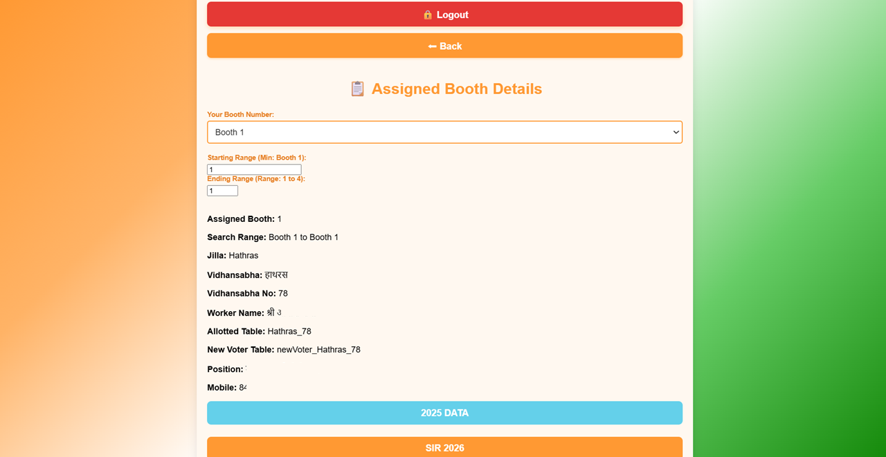

# 🗳️ ElectRevise

> A role-based voter data collection and constituency management platform built for large-scale field operations, secure verification workflows, and fast administrative reporting.


---

## 📌 Overview

ElectRevise is a full-stack operational platform designed to streamline voter list verification, booth-level data collection, constituency management, and administrative coordination.

The system was created to support distributed field teams working across districts, assembly segments, booths, and household records. It enables administrators to assign booth ranges, manage users, collect voter-level verification data, and generate downloadable reports.

The platform is optimized for real-world data-heavy workflows where thousands of voter records must be accessed quickly, updated securely, and filtered efficiently.

---

## 🎯 Problem It Solves

Traditional voter data verification processes often rely on spreadsheets, paper records, and manual coordination. This creates:

- Slow search workflows  
- Duplicate data handling  
- Poor field visibility  
- Delayed booth reporting  
- Difficult worker assignment tracking  
- High operational overhead during campaigns / revision drives

ElectRevise digitizes this entire workflow into one centralized system.

---

## 🚀 Core Capabilities

### 🔐 OTP-Based Worker Login

- Mobile number login flow
- OTP verification layer
- Role-based access control

### 🏢 Admin Dashboard

- District-level overview
- Vidhan Sabha / constituency counts
- Data refresh actions
- Bulk exports

### 🗂️ Booth Assignment Engine

- Assign workers to booth ranges
- Control searchable booth boundaries
- Worker mapping to constituency zones

### 👥 Voter Verification Console

- Search by name, father name, voter ID, house no, family ID
- Mark completed / pending records
- Update field verification progress

### 🏠 Family Grouping Support

- Auto-detect family records
- Household clustering support
- Better ground-level survey efficiency

### 📊 Reporting & Downloads

- Constituency-wise exports
- District filtered downloads
- Booth-level operational reports

---

## ⚡ Performance & Data Scale

ElectRevise is built for high-volume record operations involving structured voter datasets.

### Suitable For:

- Thousands of booth records  
- Tens of thousands of voter entries  
- Multi-district operational datasets  
- Concurrent search / filter usage by field teams

### Depends On:

Actual scale depends on:

- MySQL indexing strategy  
- Server RAM / CPU  
- Query optimization  
- Deployment infrastructure  
- Network conditions

### Practical Note

With proper indexing and production hosting, systems like this can efficiently manage large administrative datasets.

---

## 🛠 Tech Stack

| Layer | Technology |
|------|------------|
| Frontend | React.js |
| Backend | Node.js / Express.js |
| Database | MySQL |
| Authentication | OTP Login |
| Exporting | Excel / CSV |
| Deployment Ready | Yes |

---

## 🧠 Key Engineering Highlights

- Fast searchable table interfaces  
- Role-based secure access flows  
- Modular admin panels  
- Real-time progress visibility  
- Large tabular data handling UI  
- Practical workflow-driven architecture

---

## 📸 Screenshots

### Worker Login


### OTP Verification


### Admin Dashboard



### Voter Verification Console



### Booth Assignment Details



---

## 📂 Recommended Project Structure

```text
ElectRevise/
├── Frontend/
├── Backend/
├── screenshots/
├── README.md
├── .gitignore
